# PLAN Mode Activation

Strategic planning and roadmap creation for systematic implementation

> **TL;DR:** Create detailed implementation plans based on complexity level determined from Memory Bank analysis. Focus on breaking down tasks, identifying dependencies, and flagging components requiring creative phases.

## Command Usage
```
/project:workflow:plan
```

## Process Flowchart

```mermaid
graph TD
    Start["🚀 START PLANNING"] --> ReadTasks["📚 Read tasks.md<br>memory-bank/activeContext.md"]
    
    %% Memory Bank Integration
    ReadTasks --> CheckMB["📋 Check Memory Bank<br>& Previous Analysis"]
    CheckMB --> LoadContext["🔍 Load Project Context<br>& Requirements"]
    
    %% Complexity Level Determination
    LoadContext --> CheckLevel{"🧩 Determine<br>Complexity Level"}
    CheckLevel -->|"Level 2"| Level2["📝 LEVEL 2 PLANNING<br>Simple Enhancement"]
    CheckLevel -->|"Level 3"| Level3["📋 LEVEL 3 PLANNING<br>Feature Addition"]
    CheckLevel -->|"Level 4"| Level4["📊 LEVEL 4 PLANNING<br>System Architecture"]
    
    %% Level 2 Planning Process
    Level2 --> L2Review["🔍 Review Code<br>Structure"]
    L2Review --> L2Document["📄 Document<br>Planned Changes"]
    L2Document --> L2Challenges["⚠️ Identify<br>Challenges"]
    L2Challenges --> L2Checklist["✅ Create Task<br>Checklist"]
    L2Checklist --> L2Update["📝 Update tasks.md<br>with Plan"]
    L2Update --> L2Verify["✓ Verify Plan<br>Completeness"]
    
    %% Level 3 Planning Process
    Level3 --> L3Review["🔍 Review Codebase<br>Structure"]
    L3Review --> L3Requirements["📋 Document Detailed<br>Requirements"]
    L3Requirements --> L3Components["🧩 Identify Affected<br>Components"]
    L3Components --> L3Plan["📝 Create Comprehensive<br>Implementation Plan"]
    L3Plan --> L3Challenges["⚠️ Document Challenges<br>& Solutions"]
    L3Challenges --> L3Update["📝 Update tasks.md<br>with Plan"]
    L3Update --> L3Flag["🎨 Flag Components<br>Requiring Creative"]
    L3Flag --> L3Verify["✓ Verify Plan<br>Completeness"]
    
    %% Level 4 Planning Process
    Level4 --> L4Analysis["🔍 Codebase Structure<br>Analysis"]
    L4Analysis --> L4Requirements["📋 Document Comprehensive<br>Requirements"]
    L4Requirements --> L4Diagrams["📊 Create Architectural<br>Diagrams"]
    L4Diagrams --> L4Subsystems["🧩 Identify Affected<br>Subsystems"]
    L4Subsystems --> L4Dependencies["🔄 Document Dependencies<br>& Integration Points"]
    L4Dependencies --> L4Plan["📝 Create Phased<br>Implementation Plan"]
    L4Plan --> L4Update["📝 Update tasks.md<br>with Plan"]
    L4Update --> L4Flag["🎨 Flag Components<br>Requiring Creative"]
    L4Flag --> L4Verify["✓ Verify Plan<br>Completeness"]
    
    %% Verification & Memory Bank Updates
    L2Verify & L3Verify & L4Verify --> UpdateMB["📝 Update Memory Bank<br>with Planning Results"]
    UpdateMB --> CheckCreative{"🎨 Creative<br>Phases<br>Required?"}
    
    %% Mode Transition with Memory Bank Preservation
    CheckCreative -->|"Yes"| RecCreative["⏭️ NEXT MODE:<br>CREATIVE MODE"]
    CheckCreative -->|"No"| RecImplement["⏭️ NEXT MODE:<br>IMPLEMENT MODE"]
    
    %% Memory Bank System Integration
    MemoryBank["🗃️ MEMORY BANK<br>CENTRAL SYSTEM"] -.-> tasks["tasks.md<br>Source of Truth"]
    MemoryBank -.-> active["activeContext.md<br>Current Focus"]
    MemoryBank -.-> progress["progress.md<br>Implementation Status"]
    
    CheckMB & LoadContext -.-> MemoryBank
    L2Update & L3Update & L4Update & UpdateMB -.-> MemoryBank
    
    %% Security & Validation
    Start -.-> Security["🔒 Security Validation<br>- Safe file operations<br>- Validate planning scope<br>- No destructive changes"]
    
    %% Planning Templates
    L2Update -.-> Template2["📋 LEVEL 2 TEMPLATE:<br>- Overview<br>- Files to Modify<br>- Implementation Steps<br>- Potential Challenges"]
    L3Update & L4Update -.-> TemplateAdv["📋 LEVEL 3-4 TEMPLATE:<br>- Requirements Analysis<br>- Components Affected<br>- Architecture Considerations<br>- Implementation Strategy<br>- Detailed Steps<br>- Dependencies<br>- Challenges & Mitigations<br>- Creative Phase Components"]
    
    %% Styling
    style Start fill:#4da6ff,stroke:#0066cc,color:white
    style ReadTasks fill:#80bfff,stroke:#4da6ff,color:black
    style CheckLevel fill:#d94dbb,stroke:#a3378a,color:white
    style Level2 fill:#4dbb5f,stroke:#36873f,color:white
    style Level3 fill:#ffa64d,stroke:#cc7a30,color:white
    style Level4 fill:#ff5555,stroke:#cc0000,color:white
    style CheckCreative fill:#d971ff,stroke:#a33bc2,color:white
    style RecCreative fill:#ffa64d,stroke:#cc7a30,color:black
    style RecImplement fill:#4dbb5f,stroke:#36873f,color:black
    style MemoryBank fill:#f9d77e,stroke:#d9b95c,stroke-width:2px,color:black
    style Security fill:#ffcccc,stroke:#ff8080,color:black
```



## Structured Thinking Framework

### Phase 1: Context Analysis (2-3 minutes)
**Systematic requirements gathering:**
- What is the complete scope based on memory-bank/tasks.md?
- What existing systems/components will be affected?
- What are the technical constraints and dependencies?
- What is the complexity level and why?

### Phase 2: Strategic Decomposition (5-8 minutes)
**Break down the implementation systematically:**
- What are the major components or phases needed?
- Which components have clear implementation paths?
- Which components require design exploration (CREATIVE phase)?
- What is the logical sequence considering dependencies?

### Phase 3: Risk and Challenge Analysis (3-5 minutes)
**Identify potential blockers:**
- What technical challenges could arise?
- What external dependencies exist?
- What integration points need special attention?
- What fallback options should be considered?

### Phase 4: Documentation and Verification (2-3 minutes)
**Ensure plan completeness:**
- Are all requirements covered in the plan?
- Are creative phases clearly identified and justified?
- Is the implementation sequence logical?
- Are todos comprehensive and actionable?

## Memory Integration

### Required Memory Bank Operations
1. **Read planning context** from memory-bank/activeContext.md
2. **Analyze task scope** from memory-bank/tasks.md
3. **Review previous progress** from memory-bank/progress.md
4. **Update comprehensive plan** in memory-bank/tasks.md
5. **Document planning decisions** in memory-bank/progress.md

### Planning Documentation Structure
```markdown
# Implementation Plan - [Project Name]

## Requirements Analysis
[Detailed requirements from analysis]

## Components Affected
[List of files/systems that will be modified]

## Implementation Strategy
[High-level approach and methodology]

## Detailed Implementation Steps
[Phase-by-phase breakdown with specific tasks]

## Dependencies and Integration Points
[External dependencies and component interactions]

## Creative Phase Components
[Components requiring design exploration with justification]

## Risk Assessment
[Potential challenges and mitigation strategies]
```

## Security Guardrails

### Planning Safety Validations
- **Scope validation**: Ensure planning stays within project boundaries
- **File safety**: Only plan modifications to appropriate files
- **Dependency validation**: Verify all dependencies are legitimate
- **Resource constraints**: Ensure plan is realistic given constraints

### Planning Best Practices
- **Incremental approach**: Break large tasks into smaller phases
- **Clear acceptance criteria**: Define success metrics for each phase
- **Fallback planning**: Include alternative approaches for risky components
- **Documentation standards**: Maintain consistent planning documentation

## Instructions for Claude

When this command is activated, immediately switch to PLAN mode behavioral patterns:

### Your Mindset
- **Strategic thinking**: Focus on the big picture and long-term approach
- **Systematic breakdown**: Decompose complex tasks into manageable units
- **Risk-aware**: Consider dependencies, blockers, and potential issues
- **Roadmap-oriented**: Create clear paths from current state to goals

### What You Should Do

1. **Strategic Analysis**
   - Review the overall project objectives and requirements
   - Understand the current state and desired end state
   - Identify all major components and subsystems involved
   - Assess complexity levels and technical challenges

2. **Task Decomposition**
   - Break down large objectives into smaller, actionable tasks
   - Organize tasks into logical phases or milestones
   - Identify task dependencies and prerequisite relationships
   - Estimate effort levels and priority rankings

3. **Risk Assessment**
   - Identify potential blockers or technical challenges
   - Consider external dependencies (tools, APIs, resources)
   - Plan for testing and validation at each phase
   - Define fallback options for high-risk components

4. **Implementation Roadmap**
   - Create a clear sequence of phases with defined deliverables
   - Set realistic milestones with measurable outcomes
   - Use TodoWrite extensively to create actionable task lists
   - Document decision rationale and trade-offs considered

### Your Response Should Include

**Format your response like this:**

```markdown
# PLAN Mode Strategic Roadmap

## Project Analysis
**Objective**: [Clear statement of what we're trying to achieve]
**Current State**: [Where we are now]
**Target State**: [Where we want to be]
**Complexity Assessment**: [Level 1-5 with reasoning]

## Implementation Phases

### Phase 1: [Name] - [Duration estimate]
**Goal**: [What this phase accomplishes]
**Deliverables**:
- [Specific deliverable 1]
- [Specific deliverable 2]
- [Specific deliverable 3]

**Key Tasks**:
- [ ] [Actionable task 1]
- [ ] [Actionable task 2] 
- [ ] [Actionable task 3]

**Dependencies**: [What needs to be done first]
**Risks**: [Potential issues and mitigation strategies]

### Phase 2: [Name] - [Duration estimate]
[Similar structure for each phase...]

## Task Breakdown
[Detailed todo items organized by priority and dependencies]

## Decision Log
**Key Decisions Made**:
- [Decision 1]: [Rationale and alternatives considered]
- [Decision 2]: [Rationale and alternatives considered]

## Next Steps
1. **Immediate**: [What to start with right now]
2. **Short-term**: [What to tackle in the next session]
3. **Mode transition**: [When to switch to IMPLEMENT or CREATIVE]
```

### Planning Best Practices

**For Large Projects:**
- Create 3-5 major phases maximum
- Each phase should have 3-7 key deliverables
- Include testing and validation in every phase
- Plan for iteration and refinement

**For Task Management:**
- Use TodoWrite to create comprehensive task lists
- Include acceptance criteria for each major task
- Set realistic estimates and buffer time
- Organize tasks by dependencies, not just priority

**For Risk Management:**
- Identify the top 3-5 risks that could derail the project
- Have specific mitigation strategies for high-impact risks
- Plan proof-of-concepts for uncertain technical areas
- Consider both technical and process risks

### Mode Transition Signals

**Switch to IMPLEMENT when:**
- Phase 1 tasks are clearly defined and ready
- Requirements for initial deliverables are solid
- No major architectural decisions remain for the current phase
- The team is ready to start coding/building

**Switch to CREATIVE when:**
- Multiple viable approaches need exploration
- Architecture or design decisions are unclear
- Innovation or novel solutions are required
- Technical feasibility needs to be proven

**Switch to REFLECT when:**
- Planning seems to be going in circles
- Too many unknowns exist to create a solid plan
- Previous planning efforts need assessment
- Stakeholder feedback is needed before proceeding

### State Management
- Update memory-bank/tasks.md with the detailed implementation plan
- Update memory-bank/activeContext.md with planning outcomes
- Use TodoWrite to create comprehensive task breakdowns
- Document key decisions in memory-bank/progress.md

### Success Criteria
- Clear, actionable phases with defined deliverables
- Comprehensive task breakdown ready for implementation
- Risk assessment with mitigation strategies
- Realistic timeline with measurable milestones
- Smooth transition path to IMPLEMENT mode

Remember: PLAN mode is about **creating clarity and structure**. Transform complex objectives into systematic, achievable roadmaps.