# VAN Mode Activation

**V**erify, **A**nalyze, **N**avigate - Quick understanding and direction setting

> **TL;DR:** Rapid analysis and navigation mode that maintains context across sessions through Memory Bank integration. Time-boxed to 5-10 minutes maximum.

## Command Usage
```
/project:workflow:van
```

## Process Flowchart

```mermaid
graph TD
    Start["🚀 START VAN MODE"] --> CheckMB["📚 Check Memory Bank<br>& tasks.md Status"]
    
    %% Memory Bank Integration
    CheckMB --> ReadTasks["📋 Read memory-bank/tasks.md<br>& activeContext.md"]
    ReadTasks --> ReadProgress["📈 Read memory-bank/progress.md"]
    ReadProgress --> AssessState["🔍 Assess Current<br>Project State"]
    
    %% Rapid Analysis Phase
    AssessState --> AnalyzeComplexity{"🧩 Analyze Task<br>Complexity"}
    AnalyzeComplexity -->|"Level 1"| Level1["🔧 Quick Bug Fix<br>→ IMPLEMENT"]
    AnalyzeComplexity -->|"Level 2"| Level2["🔨 Simple Enhancement<br>→ PLAN or IMPLEMENT"]
    AnalyzeComplexity -->|"Level 3-4"| Level34["🏗️ Complex Feature/System<br>→ PLAN Required"]
    
    %% Decision Making
    Level1 --> DirectImpl["✅ Direct to IMPLEMENT<br>Clear path forward"]
    Level2 --> L2Decision{"🤔 Planning<br>Needed?"}
    L2Decision -->|"Yes"| ToPlan["📋 → PLAN Mode"]
    L2Decision -->|"No"| ToImpl["⚒️ → IMPLEMENT Mode"]
    Level34 --> RequiresPlan["📋 → PLAN Mode<br>(Required)"]
    
    %% Verification & Updates
    DirectImpl --> UpdateMB1["📝 Update Memory Bank<br>& activeContext.md"]
    ToPlan --> UpdateMB2["📝 Update Memory Bank<br>& activeContext.md"]
    ToImpl --> UpdateMB3["📝 Update Memory Bank<br>& activeContext.md"]
    RequiresPlan --> UpdateMB4["📝 Update Memory Bank<br>& activeContext.md"]
    
    %% Completion
    UpdateMB1 --> VerifyVAN{"✅ VAN Process<br>Complete?"}
    UpdateMB2 --> VerifyVAN
    UpdateMB3 --> VerifyVAN
    UpdateMB4 --> VerifyVAN
    
    VerifyVAN -->|"Yes"| CompleteVAN["🏁 VAN Complete<br>Transition to Next Mode"]
    VerifyVAN -->|"No"| RetryVAN["🔄 Resume VAN Process<br>Reference Memory Bank"]
    RetryVAN --> AssessState
    
    %% Memory Bank System Integration
    MemoryBank["🗃️ MEMORY BANK<br>CENTRAL SYSTEM"] -.-> tasks["tasks.md<br>Source of Truth"]
    MemoryBank -.-> active["activeContext.md<br>Current Focus"]
    MemoryBank -.-> progress["progress.md<br>Implementation Status"]
    
    CheckMB & ReadTasks & ReadProgress -.-> MemoryBank
    UpdateMB1 & UpdateMB2 & UpdateMB3 & UpdateMB4 -.-> MemoryBank
    
    %% Security & Validation
    Start -.-> Security["🔒 Security Validation<br>- No unsafe operations<br>- Read-only analysis<br>- Safe file access"]
    
    %% Styling
    style Start fill:#ccf,stroke:#333,color:black
    style CheckMB fill:#a3dded,stroke:#4db8db,color:black
    style AssessState fill:#80bfff,stroke:#4da6ff,color:black
    style AnalyzeComplexity fill:#d94dbb,stroke:#a3378a,color:white
    style Level1 fill:#4dbb5f,stroke:#36873f,color:white
    style Level2 fill:#ffa64d,stroke:#cc7a30,color:white
    style Level34 fill:#ff5555,stroke:#cc0000,color:white
    style VerifyVAN fill:#e699d9,stroke:#d94dbb,color:black
    style CompleteVAN fill:#8cff8c,stroke:#4dbb5f,color:black
    style MemoryBank fill:#f9d77e,stroke:#d9b95c,stroke-width:2px,color:black
    style Security fill:#ffcccc,stroke:#ff8080,color:black
```



## Structured Thinking Framework

When activated, follow this systematic reasoning process:

### Phase 1: Context Loading (30 seconds)
**Think through these questions:**
- What is the current state according to memory-bank files?
- What was the last action taken and its outcome?
- Are there any blocking issues or dependencies?
- What is the immediate priority based on tasks.md?

### Phase 2: Complexity Assessment (60 seconds)
**Analyze the task systematically:**
- **Level 1**: Single file fix, clear solution path
- **Level 2**: Multiple files, some planning needed
- **Level 3**: Feature addition, architectural consideration
- **Level 4**: System-wide changes, comprehensive planning required

### Phase 3: Decision Making (30 seconds)
**Determine optimal next mode:**
- Can I implement directly? → IMPLEMENT
- Do I need to plan first? → PLAN  
- Are there design decisions? → PLAN (will identify CREATIVE needs)
- Is this complete? → REFLECT

## Memory Integration

### Required Memory Bank Operations
1. **Read current state** from memory-bank/activeContext.md
2. **Check task status** in memory-bank/tasks.md
3. **Review progress** in memory-bank/progress.md
4. **Update context** with VAN analysis results

### Claude Code Memory Usage
- Use `@memory-bank/tasks.md` for task context
- Use `@memory-bank/activeContext.md` for current focus
- Use `@memory-bank/progress.md` for implementation status
- Update via Edit tool with structured entries

## Security Guardrails

### Safety Validations
- **Read-only analysis**: No file modifications during analysis
- **Safe file access**: Only read approved memory-bank files
- **No external calls**: Stay within project boundaries
- **Validate paths**: Ensure all file reads are within project scope

### Error Handling
- If memory-bank files don't exist, create minimal versions
- If task complexity is unclear, default to PLAN mode
- If analysis takes >10 minutes, escalate to PLAN mode
- Document any assumptions made during analysis

## Instructions for Claude

When this command is activated, immediately switch to VAN mode behavioral patterns:

### Your Mindset
- **Time-boxed analysis**: Maximum 5-10 minutes
- **Rapid understanding**: Get the big picture quickly
- **Decision-oriented**: Focus on "what should we do next?"
- **Navigation**: Point toward the right direction

### What You Should Do

1. **Quick Situation Assessment**
   - Read memory-bank/tasks.md to understand current objectives
   - Review memory-bank/activeContext.md for recent progress
   - Scan recent file changes or current project state
   - Identify any immediate blockers or urgent issues

2. **Rapid Analysis**
   - What is the current state of the project?
   - What are the most important next steps?
   - Are there any critical dependencies or blockers?
   - What mode would be most effective next?

3. **Clear Navigation**
   - Recommend the specific next mode (PLAN, IMPLEMENT, CREATIVE)
   - Provide 2-3 concrete immediate actions
   - Set clear expectations for the transition
   - Update todos with immediate priorities

### Your Response Should Include

**Format your response like this:**

```markdown
# VAN Mode Analysis

## Current Situation
[Brief assessment of where things stand]

## Key Findings
- [Critical insight 1]
- [Critical insight 2]  
- [Critical insight 3]

## Recommended Next Steps
1. **Switch to [MODE] mode** - [reasoning]
2. **Immediate action**: [specific task]
3. **Priority focus**: [what to tackle first]

## Updated Context
[Any important context updates for activeContext.md]
```

### Mode Transition Recommendations

**Switch to PLAN mode when:**
- Complex tasks need to be broken down
- Strategy and roadmap are unclear
- Multiple approaches need evaluation
- Dependencies need to be mapped

**Switch to IMPLEMENT mode when:**
- Clear tasks are ready for execution
- Requirements are well-defined
- Code needs to be written or modified
- Concrete deliverables are needed

**Switch to CREATIVE mode when:**
- Design decisions need exploration
- Multiple solution approaches exist
- Architecture needs to be planned
- Innovation or alternatives are needed

**Switch to REFLECT mode when:**
- Recent work needs assessment
- Learning needs to be captured
- Quality review is required
- Process improvements are needed

### State Management
- Update memory-bank/activeContext.md with VAN mode activation
- Include timestamp and brief analysis summary
- Note the recommended next mode for easy transition
- Keep the session focused and time-bounded

### Success Criteria
- Clear direction provided within 10 minutes
- Next mode identified with solid reasoning
- Immediate actions are specific and actionable
- Context is updated for smooth transition

Remember: VAN mode is about **rapid orientation and navigation**. Get your bearings quickly and point toward the most productive next step.